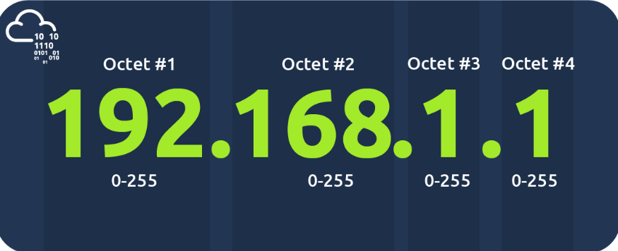
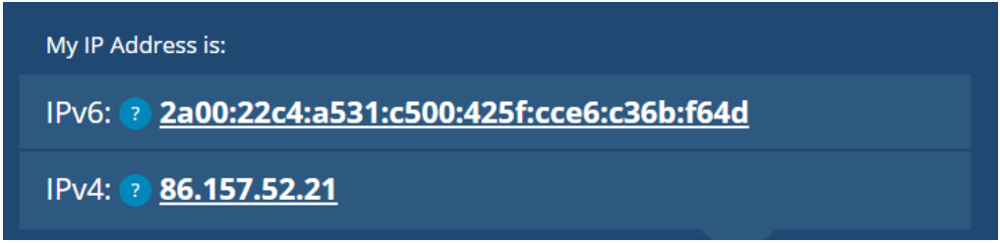
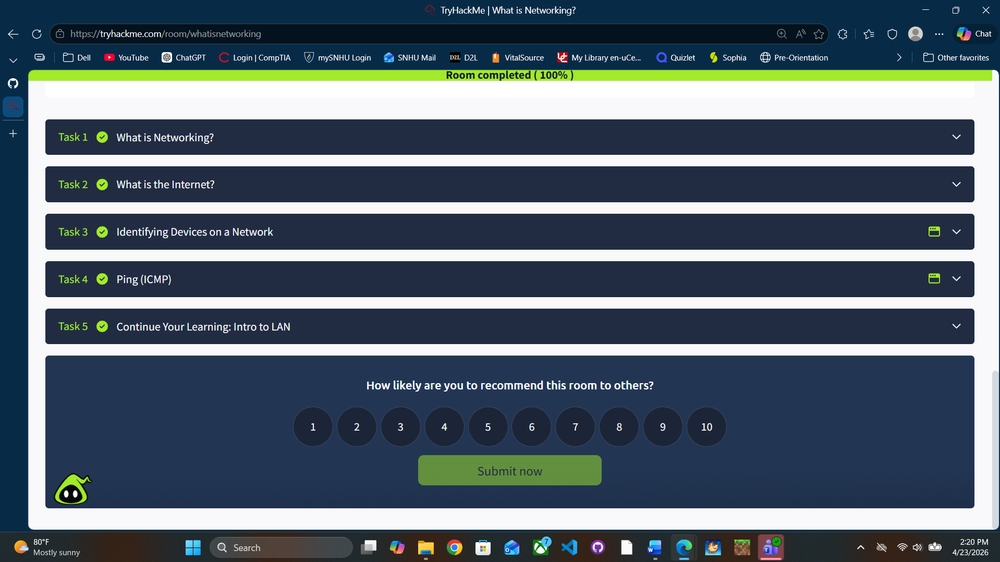

# What is Networking

## What I Learned

A network is simply things connected.

Easy way to think about it:
- Friend groups = network
- Devices connected = network

In cybersecurity, a network just means:
> devices connected so they can communicate and share data

---

## Networks in Real Life

Networks aren’t just computers. They exist everywhere:
- Transportation systems
- Power grids
- Postal systems
- Social groups

Same idea:
> things connected to move something (data, people, electricity, etc.)

---

## Networks in Computing

In tech, a network can be:
- 2 devices  
- or billions of devices  

Examples of devices:
- Phones
- Laptops
- Servers
- Cameras
- Traffic lights

Basically:
> if it can send or receive data, it can be part of a network

---

## The Internet

The Internet is:
> one massive network made up of many smaller networks

Think of it like:
- small friend groups → connected together → huge group

---

## Types of Networks

There are two main types:

- **Private Network**
  - Devices connected locally (home, school, business)

- **Public Network (Internet)**
  - Connects private networks together

---

## Why This Matters (Cybersecurity)

Networking is everywhere:
- Data transfer
- Internet access
- System communication

So if you don’t understand networks:
> you won’t understand how attacks happen

---

## Ping (Basic Tool)

Ping is used to test connection between devices.

It uses:
- **ICMP (Internet Control Message Protocol)**

How it works:
1. Your device sends a packet
2. Target sends a reply
3. Ping measures total time

Important:
> Ping measures **round trip time (there and back)**

---

## Key Commands

Example:
ping 10.10.10.10

---

## Key Concepts

- Devices must be identifiable on a network
- Two main identifiers:
  - IP Address (can change)
  - MAC Address (hardware-based)

---

## IP Address

IP = Internet Protocol

- Used to identify a device on a network
- Made of **4 sections (octets)**

Example:
192.168.1.1

Types:
- Private IP → inside network
- Public IP → on the internet

---

## IPv4 vs IPv6

- IPv4 → limited (~4.3 billion addresses)
- IPv6 → massive (~340 undecillion)

Reason:
> too many devices = need more addresses

---

## MAC Address

MAC = Media Access Control

- Physical address of a device
- Assigned at factory
- Looks like:
a4:c3:f0:85:ac:2d

---

## MAC Spoofing

Devices can fake MAC addresses.

Why this matters:
- Can bypass weak security systems
- Can pretend to be trusted devices

---

## Real-World Takeaways

- Networks = everything connected
- Internet = network of networks
- Devices need identifiers (IP + MAC)
- Ping = basic way to test connectivity
- Attackers abuse networks, not just devices

## Proof of Completion

- Platform: TryHackMe
- Room: What Is Networking
- Completed: 04/23/2026

