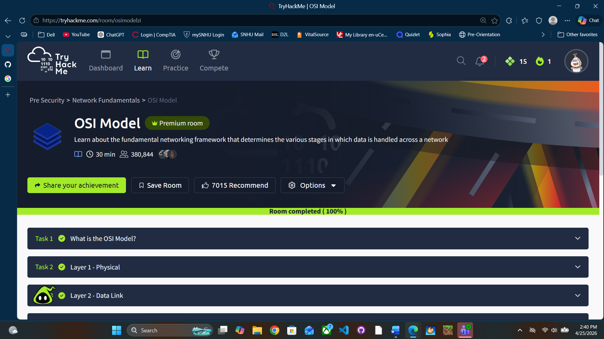

# OSI Model

---

## CORE IDEA
The OSI Model explains how data moves from one device to another through 7 layers.  
Each layer has a specific job and adds/removes information as data travels.

---

## ENCAPSULATION (SENDING DATA – TOP → DOWN)
- Data starts at **Layer 7** and moves down to **Layer 1**
- At EACH layer, something is **ADDED** (called a header)
- These headers are instructions (addresses, ports, formatting info, etc.)

---

## DECAPSULATION (RECEIVING DATA – BOTTOM → UP)
- Data arrives at **Layer 1** and moves UP to **Layer 7**
- Each layer **STRIPS OFF** its header and processes the data
- By the time it reaches Layer 7, it's usable again

---

## IMPORTANT
- **Encapsulation = add info**
- **Decapsulation = remove info**

---

## FULL DATA FLOW EXAMPLE (THIS IS THE PART YOU NEEDED)

### Sending:
1. You type `google.com` in a browser (**Layer 7**)
2. Data gets formatted/encrypted (**Layer 6**)
3. A session is created (**Layer 5**)
4. Data is split into segments + ports added (**Layer 4**)
5. IP addresses added (**Layer 3**)
6. MAC addresses added + framed (**Layer 2**)
7. Sent as electrical signals (**Layer 1**)

### Receiving:
1. Signals received (**Layer 1**)
2. Frame checked + MAC removed (**Layer 2**)
3. IP checked (**Layer 3**)
4. Segments rebuilt (**Layer 4**)
5. Session verified (**Layer 5**)
6. Decrypted (**Layer 6**)
7. Displayed to user (**Layer 7**)

---

## LAYER BREAKDOWN

---

### Layer 7 – Application
User-facing layer. Where interaction happens.

**Examples:**
- Web browsers (Chrome)
- Email apps
- DNS (turns google.com into IP)

**Hidden Data Examples:**
- Encryption keys  
- Backend code  
- API calls  

**Key Idea:**  
User interacts here, but doesn’t see the underlying processes.

---

### Layer 6 – Presentation
Handles formatting, translation, and encryption.

**Why needed:**
- Different systems store data differently → must standardize it

**Examples:**
- HTTPS encryption  
- Converting file formats  

**Key Idea:**  
Makes sure both sides understand the data.

---

### Layer 5 – Session
Manages connections between devices.

**YES — works on same network AND different networks**

**Clarification:**
“Data cannot travel across different sessions” means:  
Each communication is tied to a specific session (like a phone call).  
If the session ends, that communication ends.

**Features:**
- Opens connection  
- Maintains it  
- Closes it  
- Allows resume (checkpoints) so only new data needs to be sent  

---

### Layer 4 – Transport
Handles delivery between devices AND applications.

Breaks data into segments and rebuilds them.

**TCP:**
- Reliable  
- Ordered  
- Requires connection (handshake)  
- Used for web, files, email  

**UDP:**
- Fast  
- No guarantees  
- No connection required  
- Used for streaming, gaming  

**Clarification:**
- TCP DOES require continuous connection  
- UDP does NOT  

---

### Layer 3 – Network
Handles IP addressing and routing between networks.

**Key Idea:**
- IP tells data WHICH NETWORK to go to

**Routing:**
- Routers decide best path

**Protocols clarified:**
- OSPF = uses fastest path (based on cost, not just hops)  
- RIP = uses hop count (simple but less efficient)  

**IMPORTANT:**
- Reassembly mostly happens at Transport, not Network  

---

### Layer 2 – Data Link
Handles communication within the SAME network using MAC addresses.

**BIG CONFUSION FIXED:**
- IP = gets data to correct NETWORK  
- MAC = gets data to correct DEVICE inside that network  

**Process:**
1. Packet arrives with IP  
2. Device uses ARP to find MAC (stored in cache)  
3. Frame is created with MAC address  
4. Sent locally  

**Why needed:**
- Routers don't care about MAC — switches do  

**NIC Explanation:**
- NIC operates at Layer 2 and 1  
- MAC address is Layer 2  
- Physical signal handling is Layer 1  

**“Formatting for transmission”:**
- Turning packets into frames  
- Adding error checking (CRC)  

---

### Layer 1 – Physical
Sends raw bits over medium.

**Examples:**
- Ethernet cables  
- Wi-Fi signals  
- Fiber optics  

**Key Idea:**
- Just sends 1s and 0s  
- No logic, no addressing  

---

## FINAL MEMORY HOOK

- **Layer 4 = Segments**
- **Layer 3 = Packets**
- **Layer 2 = Frames**
- **Layer 1 = Bits**

---

## WHY THIS MATTERS (SOC PERSPECTIVE)

- Wireshark shows **frames (Layer 2) and packets (Layer 3)**
- Logs often reference **IP (Layer 3)** and **ports (Layer 4)**
- Attacks target specific layers:
  - DDoS → Layer 3/4  
  - ARP spoofing → Layer 2  
  - DNS attacks → Layer 7  

If you understand OSI, you understand **where an attack is happening and how to investigate it.**

## Proof of Completion

- Platform: TryHackMe
- Room: OSI Model
- Completed: 04/25/2026

