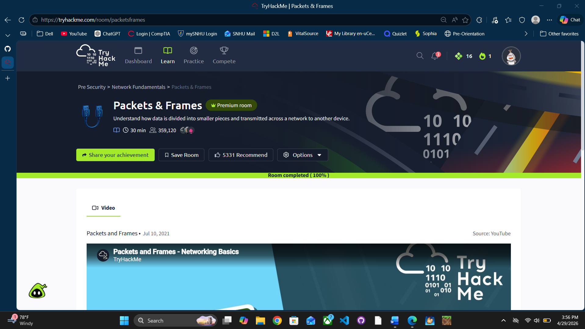

# Packets, Frames, TCP, UDP, and Ports

---

## Packets vs Frames

### What They Are
- Packets and frames are small pieces of data
- Combined together → form a full message

### Layer Difference
- Packet (Layer 3 – Network)
  - Contains IP header + payload
- Frame (Layer 2 – Data Link)
  - Encapsulates packet
  - Adds MAC addresses

### Analogy
- Frame = envelope
- Packet = letter inside
- Frame delivers packet
- Packet contains actual message

---

## Encapsulation

- Data moves down the layers
- Each layer adds a header
- Reverse process = decapsulation

### Key Rule
- IP involved → Packet
- MAC involved → Frame

---

## Why Packets Are Used

- Data sent in small chunks
- Reduces congestion
- Prevents bottlenecks

### Example
- Images load in pieces (packets)
- Reassembled on your machine

---

## Packet Structure (IP)

### Important Fields

- TTL (Time To Live)
  - Prevents infinite looping
  - Decreases each hop
  - Dropped at 0

- Checksum
  - Verifies integrity
  - Mismatch = corrupt data

- Source Address
  - Sender IP

- Destination Address
  - Receiver IP

---

## Definitions

- With IP → Packet
- Without IP → Frame

---

## UDP (User Datagram Protocol)

### Core Concept

- Stateless
- No connection required
- No handshake
- No acknowledgements

---

### When UDP Is Used

- Video streaming
- Voice calls
- Situations where speed matters more than reliability

---

### Advantages

- Fast
- No connection setup
- No resource reservation
- Flexible

---

### Disadvantages

- No guarantee of delivery
- No error checking
- No ordering
- Poor performance on unstable networks

---

### UDP Structure

- TTL (L3)
- Source IP (L3)
- Destination IP (L3)
- Source Port
- Destination Port
- Data (payload)

---

## TCP (Transmission Control Protocol)

### Core Concept

- Connection-based
- Must establish connection first
- Guarantees:
  - Delivery
  - Order
  - Integrity

---

### TCP/IP Model

- Application
- Transport
- Internet
- Network Interface

---

### Encapsulation (TCP)

- Data moves down layers
- Each layer adds headers
- Reverse = decapsulation

---

### Advantages

- Reliable
- Ordered data
- Integrity guaranteed

---

### Disadvantages

- Slower than UDP
- Requires stable connection
- Missing data must be resent
- Uses more system resources

---

### TCP Header (Layer 4)

- Source Port (random sender port)
- Destination Port (service port, ex: 80)
- Sequence Number (tracks order)
- Acknowledgement Number (next expected)
- Checksum (verifies integrity)
- Flags (control behavior)

#### Not TCP Header
- Source IP → Layer 3
- Destination IP → Layer 3
- Data → payload (not header)

---

### TCP Flags

- SYN → start connection
- ACK → acknowledge
- FIN → clean close
- RST → force close
- SYN/ACK → SYN + ACK combined

---

### Three-Way Handshake

SYN → SYN/ACK → ACK

---

### Data Transmission

- Happens after handshake
- Uses sequence numbers
- Maintains order

---

### Sequence Numbers

- Start random (ISN)
- Increment by 1
- Ensure correct order

---

### Closing Connection (Clean)

- Uses FIN

Process:
1. Send FIN
2. Receive ACK
3. Other device sends FIN
4. Final ACK

---

### Reset Connection (Abrupt)

- Uses RST
- Immediately terminates connection
- No cleanup

---

## Ports

### What Ports Are

- Numerical communication endpoints
- Range: 0–65535

---

### Analogy

- Port = docking station
- Device must connect to correct port
- If incompatible → connection fails

---

### Why Ports Matter

- Identify which application is communicating
- Prevent communication conflicts

---

### Common Ports

| Protocol | Port | Purpose |
|----------|------|--------|
| FTP | 21 | File transfer |
| SSH | 22 | Secure login |
| HTTP | 80 | Web traffic |
| HTTPS | 443 | Secure web traffic |
| SMB | 445 | File/printer sharing |
| RDP | 3389 | Remote desktop |

---

### Important Notes

- Ports can be changed (ex: 8080 instead of 80)
- Applications assume default ports
- Custom ports require:
  IP:PORT

---

## Final Takeaways

- Packet = Layer 3 (IP)
- Frame = Layer 2 (MAC)
- TCP = reliable, connection-based
- UDP = fast, stateless
- Ports = identify services
- Handshake = SYN → SYN/ACK → ACK
- FIN = clean close
- RST = forced close

## Proof of Completion

- Platform: TryHackMe
- Room: Packets & Frames
- Completed: 04/29/2026

