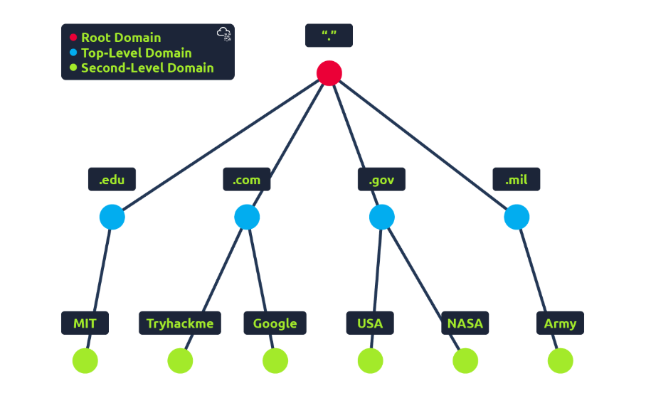
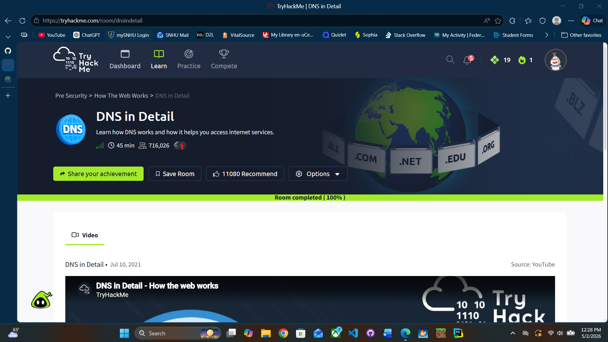

# DNS In Detail

## What is DNS?
- Domain Name System
- Translates human-readable domain names to IP addresses
- Example:
  - www.google.com → (some IP address, varies by location)
- 8.8.8.8 = one of Google’s DNS servers (public resolver)
- Domain name ≠ URL

### URL Breakdown
Example:
https://www.google.com/search?q=test&num=5

- https = protocol (uses port 443 by default)
- www.google.com = domain name
- /search = path
- ? = start of the query
- q=test = initial parameter (search for "test")
- &num=5 = additional parameter (limits results per page)

## Domain Hierarchy

DNS resolves a domain (e.g., admin.google.com) by moving through the domain hierarchy.

### Root Domain
- Represented as .
- Not visible in normal URLs
- If visible: admin.google.com.
- Does NOT know the IP address
- Sees the TLD (.com) and refers the request to .com servers

Root facts:
- Made up of 13 logical server clusters worldwide (many physical servers via anycast)
- Acts as a directory to TLD servers

### Top-Level Domain (TLD)
- Examples: .com, .org, .edu, .gov
- Does NOT know the final IP address
- Responsible for all domains under that extension
- Looks at the next part of the domain (google)
- Refers the request to the authoritative DNS servers for google.com

TLD facts:
- Two types:
  - gTLD (generic): .com, .org, .edu
  - ccTLD (country code): .us, .ca, .uk
- Intended to indicate purpose or location

### Second-Level Domain
- The main domain name (google)
- Controlled by the domain owner
- The authoritative DNS server for google.com:
  - Knows the IP addresses
  - Looks at full request (admin.google.com)
  - Returns the correct IP

### Subdomain
- Anything to the left of the second-level domain
- Example: admin.google.com
- Used to organize services or sections
- Can point to different servers than the main domain
- Can be stacked:
  - dev.admin.google.com
- Entire domain length limit: 253 characters

## DNS Record Types

- DNS is not only for websites
- DNS records = data stored on DNS servers that define how a domain works
- DNS = phonebook
- DNS records = entries in the phonebook

### A Record
- Resolves domain names to IPv4 addresses
- Example:
  - google.com → 142.250.x.x

### AAAA Record
- Resolves domain names to IPv6 addresses

### CNAME Record (Alias)
- Maps one domain name to another domain name

Example:
store.tryhackme.com → shops.shopify.com

- Then another DNS lookup happens:
  - shops.shopify.com → IP (via A/AAAA record)

### MX Record (Mail Exchange)
- Tells where to send email for a domain

Example:
website.com → mail server: mail.website.com (priority 10)

- Email servers use this record to decide where to deliver mail
- Priority number:
  - Lower number = higher priority
  - Example:
    - 10 = primary mail server
    - 20 = backup mail server

### TXT Record
- Stores arbitrary text data for a domain

Common uses:
- SPF (email verification)
- DKIM (email signing)
- Domain verification

Example:
"v=spf1 include:_spf.google.com ~all"

## How DNS Works (Full Process)

### Step-by-Step (No Cache)

1. User enters domain (admin.google.com)
2. Computer sends request to a recursive DNS server
3. Recursive server asks root servers
4. Root points to .com TLD servers
5. TLD points to authoritative servers for google.com
6. Authoritative server:
   - Looks at records
   - Finds correct IP for admin.google.com
7. IP is returned to the user
8. Browser connects to the server using that IP

## Recursive DNS Server
- Usually provided by your ISP (or public like 8.8.8.8)
- Responsible for performing the full lookup process
- Caches results to speed up future requests

## Authoritative DNS Server
- Holds all DNS records for a domain
- Provides the final answer (IP, MX, etc.)

## DNS Caching and TTL

### TTL (Time To Live)
- Specifies how long a DNS response should be cached
- Measured in seconds

Example:
- TTL = 3600 → cache for 1 hour

### Why caching matters
- If a domain was recently looked up:
  - DNS server already has the answer
  - No need to query root/TLD again
- Faster response and less network traffic

## Clean Mental Model
- DNS = "Where is the server?"
- HTTP = "What do you want from the server?"
- Recursive server = does the work
- Root/TLD = give directions
- Authoritative = gives the final answer
- Records = actual data used to answer

## Proof of Completion

- Platform: TryHackMe
- Room: DNS in Detail
- Completed: 05/02/2026

