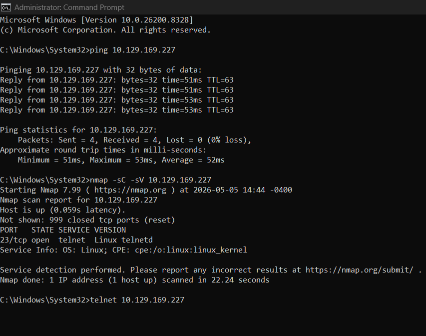
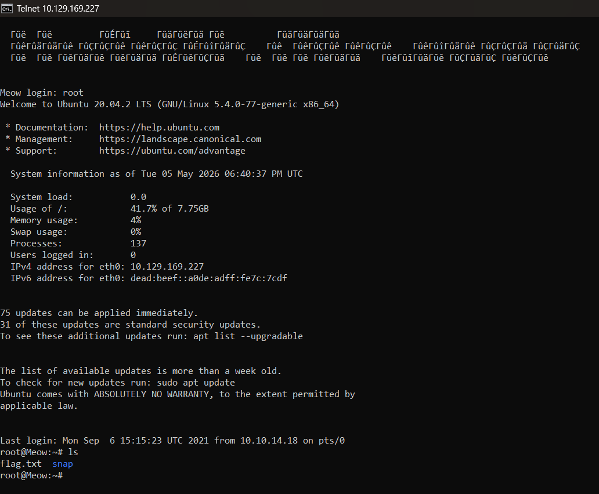

# Hack The Box - Meow

## Lab Info

### Platform:
Hack The Box

### Path / Series:
Starting Point

### Machine:
Meow

### Date:
05/05/2026

### Difficulty:
Very Easy

### Main Topic:
Telnet enumeration and blank root login

### Target IP:
10.129.169.227

### Objective:
Connect to the target machine, confirm it is reachable, scan for open services, identify a way to access the machine, and retrieve the flag.

---

## Quick Summary

This lab focused on basic enumeration and remote login. I connected to the Hack The Box VPN, confirmed that the target was reachable with `ping`, scanned the machine with `nmap`, found Telnet running on port `23/tcp`, connected to the Telnet service, logged in as `root` with a blank password, and retrieved the flag from `flag.txt`.

The main lesson from this machine is that exposed remote login services combined with weak or blank credentials can lead to full system access.

---

## Setup / Connection Notes

- Connected to Hack The Box using OpenVPN.
- Pwnbox was not available because the free Pwnbox time limit was used.
- OpenVPN showed a successful connection.
- The target machine was started from the Meow machine page.
- The target IP was `10.129.169.227`.
- The IP had changed from the previous session, so I had to make sure I used the current IP shown by Hack The Box.

---

## Recon / Enumeration

### What I Did:
- Used `ping` to confirm the target was reachable.
- Used `nmap` to scan the target for open ports and services.
- Reviewed the Nmap output to decide what service to test next.

### Commands Used:
```cmd
ping 10.129.169.227
nmap -sC -sV 10.129.169.227
```

## Screenshots: 




