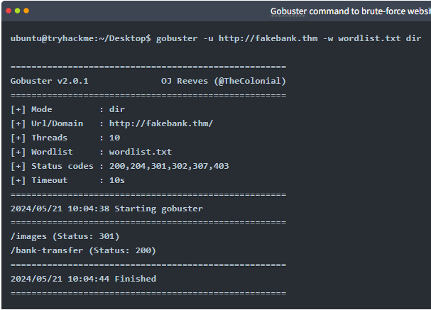

# TryHackMe - Offensive Security Intro

## What I Learned

Offensive security is about simulating attacks to find weaknesses.

Goal:
- Think like an attacker
- Find vulnerabilities before real attackers do

---

## Enumeration (Key Concept)

Enumeration = systematically probing a target to find:
- Hidden directories
- Endpoints (any device where communication starts or ends on a network/anything that sends or receives data)
- Users
- Services

This helps map out the attack surface.

---

## Tool: Gobuster

Used to brute-force (try everything until something works) directories on a website

Example:
gobuster -u http://fakebank.thm -w wordlist.txt dir

Breakdown:
- -u → target (http://fakebank.thm)
- -w → wordlist (appended to the end of the target url)
- dir → mode (dir means it's searching for directories)

---

## Important Concepts

Hidden directories:
- Not linked publicly
- Still accessible if you know the path

Status codes:
- 200 → page exists
- 301 → redirect
- 403 → exists but blocked

---

## Vulnerability Found

- /bank-transfer page was exposed
- No authentication required
- Anyone could transfer money

Proper term:
- Missing access controls on a sensitive endpoint

---

## Real-World Takeaways

- Hidden does NOT mean secure
- Attackers actively search for hidden endpoints
- Access control is critical

## Proof of Completion

- Platform: TryHackMe
- Room: Offensive Security Intro
