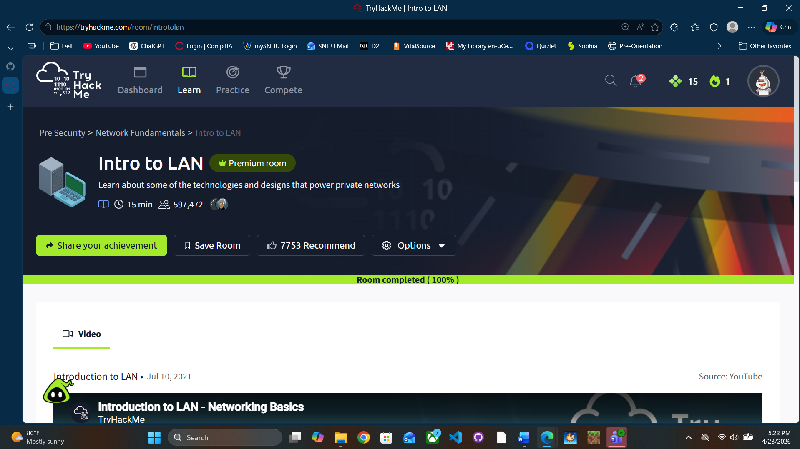

# Intro To LAN (Clean & Expanded Notes)

## 1. Subnetting

Subnetting:
- Splitting a network into smaller networks
- Used to organize devices and control traffic

Analogy:
- Like cutting a cake into slices so everyone gets a portion

### Why Subnetting Exists

Used to:
- Separate departments (HR, Finance, etc.)
- Control communication
- Improve security and efficiency

### How It Works

- IP addresses = 32 bits total  
- Subnet mask = also 32 bits  

Subnet mask determines:
- which part = network  
- which part = host  

### Subnet Mask Basics

- Written like:
255.255.255.0

- Or CIDR:
/24

These mean the same thing

### CIDR vs Subnet Mask

- /24 → 255.255.255.0 (3 octets network)
- /25 → 255.255.255.128 (split in half)
- /26 → 255.255.255.192 (split into 4)

### Example

192.168.1.0/24

Range:
192.168.1.0 – 192.168.1.255

Split:
/25 → 192.168.1.0 – 127
/25 → 192.168.1.128 – 255

Subnetting = splitting ranges, not assigning IPs

### Address Types

Network Address:
- Identifies network
- First IP (192.168.1.0)

Host Address:
- Assigned to devices (192.168.1.100)

Default Gateway:
- Sends data to other networks
- Usually .1 or .254

---

## 2. ARP (Address Resolution Protocol)

ARP:
- Matches IP address to MAC address

### How It Works

1. Device sends: Who has this IP?
2. Correct device replies with MAC
3. Mapping is stored

### ARP Cache

Each device has its own ARP cache

Stores:
- IP → MAC mappings

Clearing cache:
- Removes stored mappings
- Forces new ARP request

---

## 3. DHCP

DHCP:
- Automatically assigns IP addresses

### Process (DORA)

1. Discover → Who has IP?
2. Offer → Here’s one
3. Request → I want it
4. ACK → Approved

---

## 4. LAN Topologies

Topology = network layout

### Star
- Central switch
- Reliable but expensive
- Switch failure = network down

### Bus
- One cable
- Cheap but slow
- Broadcasts to all devices

### Ring
- Devices in loop
- Data moves device to device

Bus vs Ring:
- Bus = broadcast to all
- Ring = passes through devices

---

## 5. Network Devices

Switch:
- Sends data only to correct device

Hub:
- Broadcasts to all devices

Repeater:
- Boosts signal
- Extends range

Router:
- Connects networks
- Controls data paths

---

## Key Takeaways

- Subnetting = splitting networks
- ARP = IP to MAC
- DHCP = auto IP assignment
- Topologies = layouts
- Router = connects networks

## Proof of Completion

- Platform: TryHackMe
- Room: Intro To LAN
- Completed: 04/23/2026

